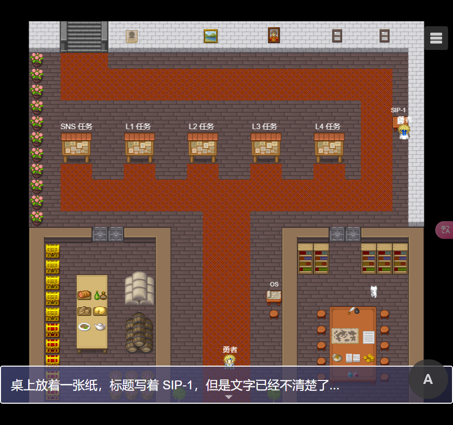

# SeeDAO Online

SeeDAO 多人线上 RPG 游戏，使用 RPG.JS

[示范网站 (DEMO)](https://www.seeplus.xyz/)



## 开始使用

拉取代码:

```bash
git clone https://github.com/SeeDAO-OpenSource/seedao-online.git
cd seedao-online
```

安装依赖：

```bash
npm install
npm run dev
```

打开 [localhost:3000](http://localhost:3000)，你应该能看到游戏运行。编辑 `main` 中的文件，保存后刷新页面即可看到更改。

> 使用 `RPG_TYPE=rpg npm run dev` 命令在 RPG 模式下启动

## 生产环境

### 使用 NodeJS 构建

```bash
NODE_ENV=production npm run build

# Windows 环境
$env:NODE_ENV="production"; npm run build
```

### 使用 Docker 构建

```bash
sudo docker build -t rpg .
sudo docker run -p 3000:3000 -d rpg
```

## RPGJS 资源

[RPGJS 文档](https://docs.rpgjs.dev)
[RPGJS 社区帮助](https://community.rpgjs.dev)

### 音效

[Davidvitas](https://www.davidvitas.com/portfolio/2016/5/12/rpg-music-pack)
署名 4.0 国际 (CC BY 4.0) - https://creativecommons.org/licenses/by/4.0/deed.zh

### 图形

[Pipoya](https://pipoya.itch.io)

### 图标

https://game-icons.net

### LICENSE

MIT